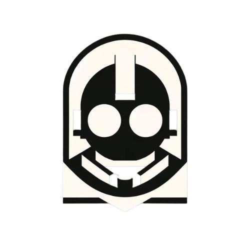

<div align="center">
  
  <a href="https://www.tockanest.com" style="text-decoration: none; color: #F7F4F3">
      <h1>Kommandant Zentrale</h1>
      <h4>Befehlen, steuern und koordinieren.</h4>
  </a>
</div>

---

<h3 align="start">📖 About</h3>

This repository is the source code for the Kommandant Zentrale discord bot. This bot is being developed by Tocka Nest.

This is a work in progress, should not be used in production. But you do you.

---

<h3 align="start">🚀 Technologies</h3>

This project was/is being built with the following technologies:

- [Node.js](https://nodejs.org/en/)
- [Typescript](https://www.typescriptlang.org/)
- [Discord.js](https://discord.js.org/)
- [MongoDB](https://www.mongodb.com/)
- [Mongoose](https://mongoosejs.com/)
- [Dotenv](https://www.npmjs.com/package/dotenv)
- [Fastify](https://www.fastify.io/)
- [Twurple](https://twurple.js.org/)

In total, this project uses 6 libraries and 3 Technologies.

This might grow in the future.

---

<h3 align="start">📦 Installation</h3>

To install this project, you will need to have Node.js installed on your machine.

You can download Node.js from the following link: [Node.js](https://nodejs.org/en/)

After you have installed Node.js, you can clone this repository to your machine and run the following command to install

all the dependencies:

```bash
git clone https://github.com/tockanest/Kommandant-Zentrale.git
cd kommandant-zentrale
npm install
npm run install::global
```

---

<h3 align="start">🔨 To Work On</h3>

- [X] Create the main Event Handler.
- [X] Create the main Command Handler.
- [X] Create the main Database Handler.
- [ ] Create the commands.
- [ ] Finish integrations.
-
    - [ ] Finish Twitch integration.
-
    - [ ] Start Youtube integration.
-
    - [ ] Start Twitter integration.
- [ ] Create a dashboard.
- [ ] Test everything and fix bugs.
